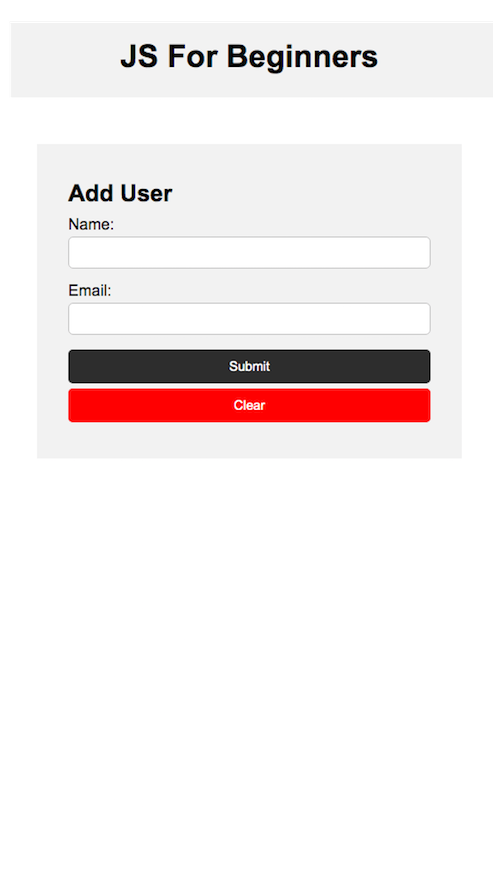

# simple-form
This is a simple form for my studies at DOM in javascript an also study HTML and CSS

You can add user name's and their email. I added the button and functionality to clear the form fields if you type wrong. 😁

<p align="center" >

</p>
  
## 👷‍ Installation
Clone this repository
```git clone https://github.com/renantb/simple-form/edit/master/README.md  ```

You can open the index.html file with your browser and it's read to use! 😁


## 🚀 Technologies

This project was developed with the following technologies:

- HTML
- CSS
- JavaScript

Made with ♥ by [Renan Bastos](https://github.com/renantb)
